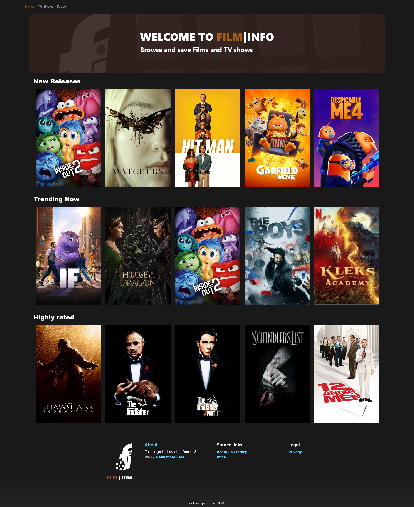
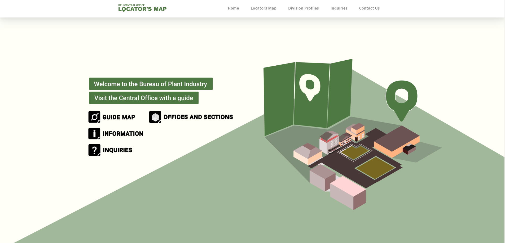
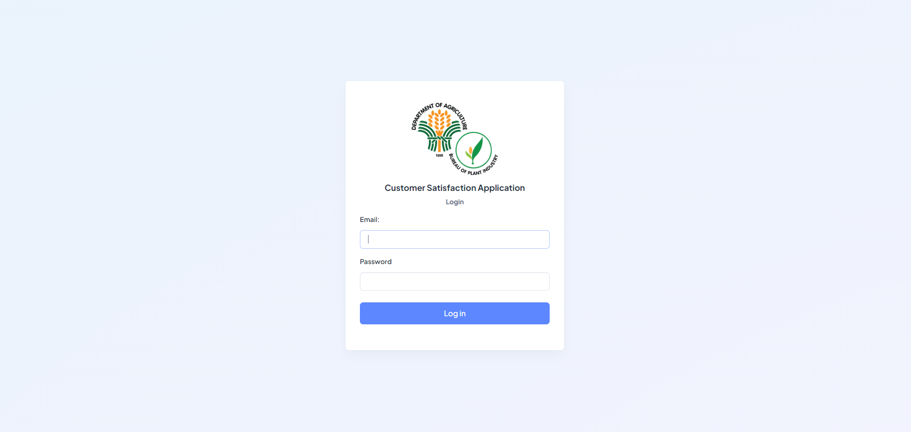

👋 Hi, names Josh!

🌱 Currently learning and building projects from the React library for web development application. I am also building projects for web development from Laravel which is a PHP framework. Will be learning C# in the future for reliable, and stable desktop applications. 

Here are some of small sample projects that demonstrates my understanding with the React library and Javascript programming: 

Projects being worked on:
 [Film-info project](https://lomeda-joshua.github.io/film-info/).  

 [BPI Locator's map](https://lomeda-joshua.github.io/locators-map/). 

 Customer Satisfaction Form Application: 

<!---
Lomeda-Joshua/Lomeda-Joshua is a ✨ special ✨ repository because its `README.md` (this file) appears on your GitHub profile.
You can click the Preview link to take a look at your changes.
--->
