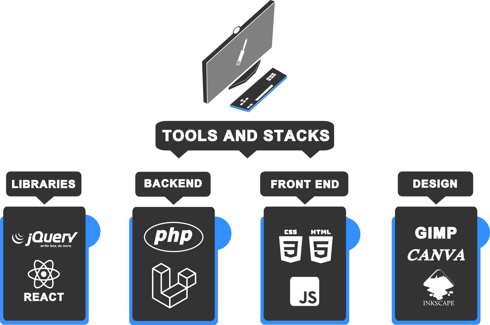

# Joshua (Josh)

> Backend Software Developer specializing in **PHP** and **Laravel**, building internal business applications and information management systems.

---

# About Me

I'm a backend developer with professional experience building web applications for government agencies and private organizations using **PHP**, **Laravel**, and **SQL**.

My work has primarily focused on developing systems that automate business processes, manage organizational data, and improve internal operations through custom web applications.

Currently, I'm expanding my knowledge into **Docker**, **Python**, **System Design**, **Rust**, and **AI-assisted software development** to become a more well-rounded software engineer.

---

# Technical Stack

<h2>Technical Stack</h2>

<table>
<tr>
<td valign="top" width="50%">

### Backend

- PHP
- Laravel
- REST APIs
- MVC
- Eloquent ORM

### Database

- MySQL
- PostgreSQL

</td>

<td valign="top" width="50%">

### Infrastructure

- Git
- Linux
- Apache
- Docker *(Learning)*

### Cloud

- AWS EC2
- Alibaba Cloud ECS

</td>
</tr>
</table>

---

# Featured Projects

## 📦 Assets & Inventory Management System

Enterprise inventory platform built with Laravel and PostgreSQL featuring RBAC, inventory lifecycle management, and production deployment.

## 📁 Documentation Archiving System

Customized enterprise document management platform using SeedDMS with workflow automation, access control, and document categorization.

## 🏛 Citizen Information System

Laravel-based government information system supporting citizen records, senior citizen services, and benefits management.

## 📊 Customer Satisfaction System

Internal Laravel application replacing manual paper-based customer feedback collection with centralized digital management.

---

# Current Learning Roadmap

I'm actively studying technologies that strengthen backend engineering and prepare me for AI-focused software development.

* Docker
* Python
* Rust
* System Design
* Machine Learning Fundamentals
* AI Engineering Workflows

---

# Engineering Philosophy

I enjoy building software that solves practical operational problems.

Rather than chasing every new framework, I focus on understanding software fundamentals, writing maintainable backend systems, and continuously improving my engineering skills through hands-on projects.

---

# Current Goals (2026)

* Build production-ready Docker environments
* Learn Python for backend automation and AI tooling
* Develop open-source backend projects
* Study scalable system design
* Explore AI integration into web applications

---

# Let's Connect

I'm always interested in collaborating with projects that now involve real world application of codes and technologies especially on the field of business.

---
