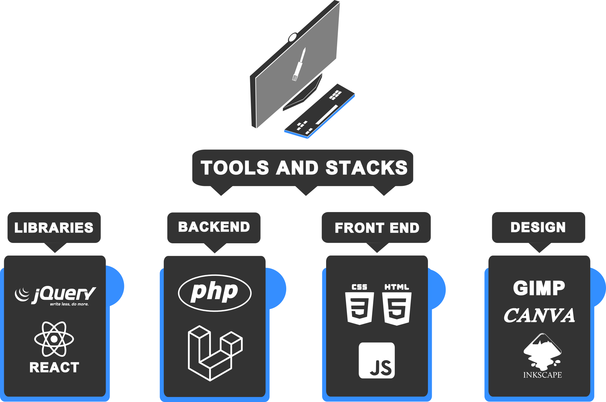

# 👋 Hi, names Josh!
I use php for backend development along with Laravel framework in building web applications, Exploring also into system design and development with the use of Rust for a deep learning into system programing and machine learning.

        
# 📊 My Stats:

<!---
Lomeda-Joshua/Lomeda-Joshua is a ✨ special ✨ repository because its `README.md` (this file) appears on your GitHub profile.
You can click the Preview link to take a look at your changes.
--->
